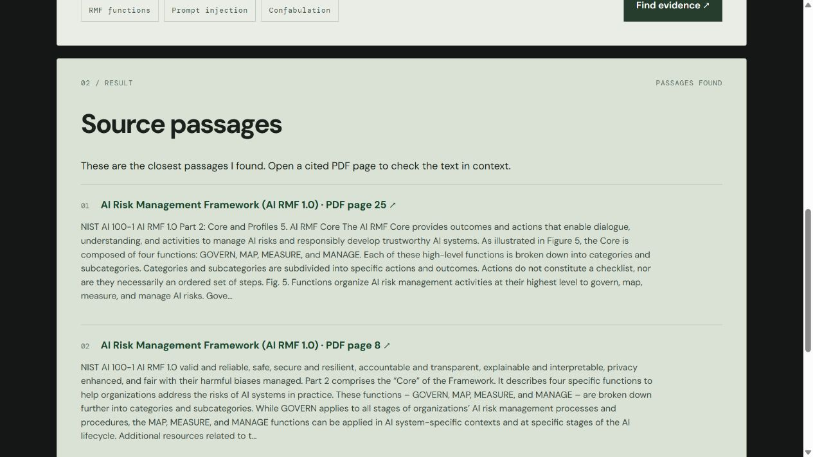

# Evidence Desk

I built this as a document-search experiment over two public NIST publications: the [AI Risk Management Framework](https://nvlpubs.nist.gov/nistpubs/ai/NIST.AI.100-1.pdf) and its [Generative AI Profile](https://nvlpubs.nist.gov/nistpubs/ai/NIST.AI.600-1.pdf). Ask about a topic, and the app shows the closest passages with links to the exact PDF pages. The aim is to make the evidence visible before trusting an answer.

[Try the public browser demo](https://om7203.github.io/om-vaghasiya-portfolio/evidence/) · [Read the portfolio case study](https://om7203.github.io/om-vaghasiya-portfolio/projects/evidence-desk.html)

This first version is **extractive retrieval**, not a generative AI assistant. The local API uses word and character TF-IDF; the public browser demo uses BM25. Neither calls an LLM. A matching passage still needs human verification. The two implementations give me reproducible baselines to compare with embeddings and grounded generation later.



## Run locally

Python 3.11+ is recommended. The commands below download roughly 3 MB of public PDFs from NIST. No account or API key is needed.

```bash
python -m venv .venv
# Activate .venv for your shell, then:
pip install -r requirements.txt
python download.py
python engine.py
python -m unittest discover -s tests -v
python evaluate.py
uvicorn app:app --host 127.0.0.1 --port 8000
```

Open `http://127.0.0.1:8000`. The API is `POST /api/ask` with JSON such as `{"question":"What is prompt injection?"}`; `GET /health` reports index availability. The API documentation is at `/docs`.

## What I measured

The current [evaluation](docs/evaluation.json) has nine hand-checked, in-scope questions and two unrelated questions. The expected PDF page appeared first in **8/9** in-scope cases and in the first three in **9/9**. Both unrelated questions returned no evidence. This small, non-blinded set is useful for regression checks, not a claim about general accuracy. “What is confabulation?” ranked an action table ahead of the actual definition page. The evaluation reports that miss.

The public demo runs a smaller **BM25 search** directly in the visitor’s browser over the same passages. On the same small set, its [separate evaluation](browser/evaluation.json) finds the expected page first in **7/9**, in the top three in **9/9**, and declines both unrelated questions. Its misses are about the MAP and MEASURE functions. I show these separately because the browser demo and local API use different ranking algorithms.

## How it works

1. `download.py` fetches the source PDFs and records their SHA-256 hashes locally.
2. `engine.py` extracts text page by page, splits it into overlapping passages, and saves an index.
3. At startup, the server fits word and character TF-IDF vectors over those passages.
4. A query ranks passages by a weighted cosine score, keeps one passage per PDF page, and links each result to its source page.

[Architecture and decisions](docs/ARCHITECTURE.md) explain the pipeline and next experiments. The PDFs and generated index are excluded from Git so the repository stays small; the exact official source URLs remain in `sources.json`.

`python export_browser.py` turns the local index into the public `browser/corpus.json` (about 367 KB) and copies the [source hashes](browser/source-manifest.json). The browser assets are copied into the portfolio's `docs/evidence/` folder for GitHub Pages. This corpus contains extracted text from the two public NIST publications; it contains no personal or company documents. The public demo sends no question to a server.

## Where it stands

This is a **production-minded prototype**, not a production service. It has bounded input, explicit errors, a health check, repeatable source ingestion, tests, and visible evaluation. Before serving real users or private documents I would add authentication and access control, upload scanning, rate limiting, structured logs and monitoring, deployment checks, a privacy policy for submitted questions, more representative evaluation, and an incident/rollback plan. The app currently accepts only two fixed public PDFs; it has no private-document upload and does not store questions.

Next I plan to compare this lexical baseline with an embedding retriever, then add a controlled answer step that can cite retrieved passages and abstain when evidence is weak. I will report measured wins and regressions before calling either an improvement.
