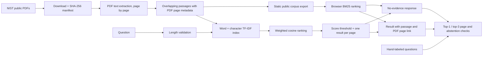

# Evidence Desk architecture

The index keeps **PDF page numbers**, not the page numbers printed in the publication footer. This makes `#page=N` links open the actual cited page in a PDF viewer.

The baseline weights word TF-IDF at 0.7 and character TF-IDF at 0.3. Character features help with acronyms and minor wording differences; neither method understands meaning. The 0.11 score cutoff is an initial heuristic, selected on a very small set. It is not a calibrated confidence probability. The app calls a result “evidence found” only in the sense that a passage crossed this cutoff; the visitor must verify that it actually answers the question.

The public browser version uses BM25 over the same extracted passages. It has no API request for questions and no account or key. Its query-token coverage rule can decline unrelated questions, but it is also a heuristic, not calibrated confidence. The [browser evaluation](../browser/evaluation.json) is separate from the Python result because the rankers differ.

The next comparison should preserve the same source PDFs and evaluation cases. I would test a small embedding model against this baseline, add paraphrase and adversarial questions, and measure page recall, false citation rate, abstention quality, latency, and memory use. Only after retrieval improves would I add a model-generated answer constrained to retrieved passages. Any answer claim should be checked against its cited text.

This corpus is intentionally fixed and public. Supporting user uploads would introduce malware, privacy, copyright, and access-control concerns that this prototype does not handle.
